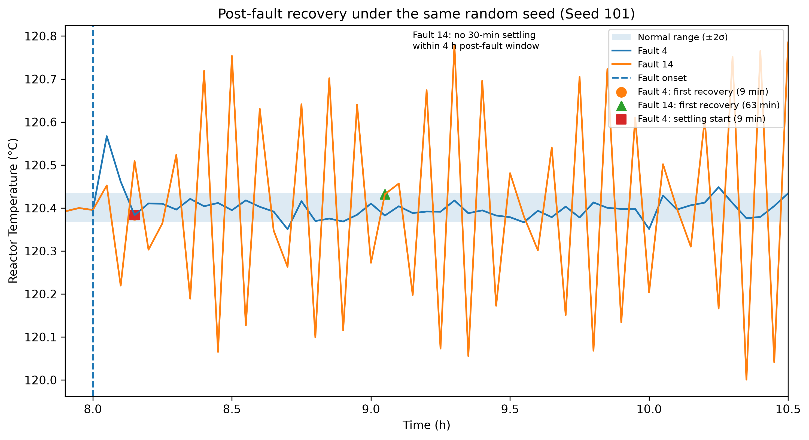
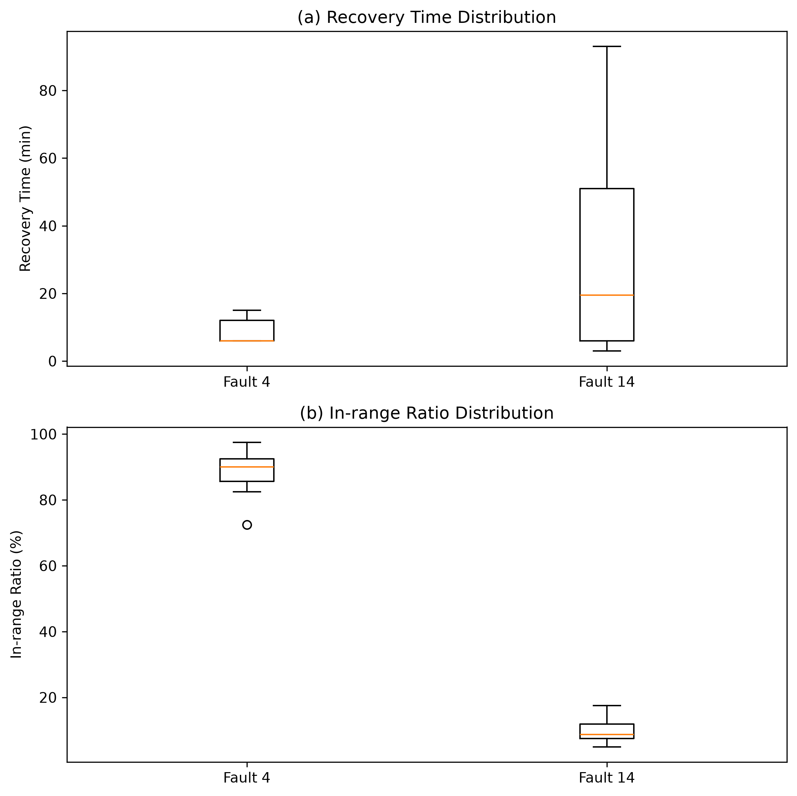
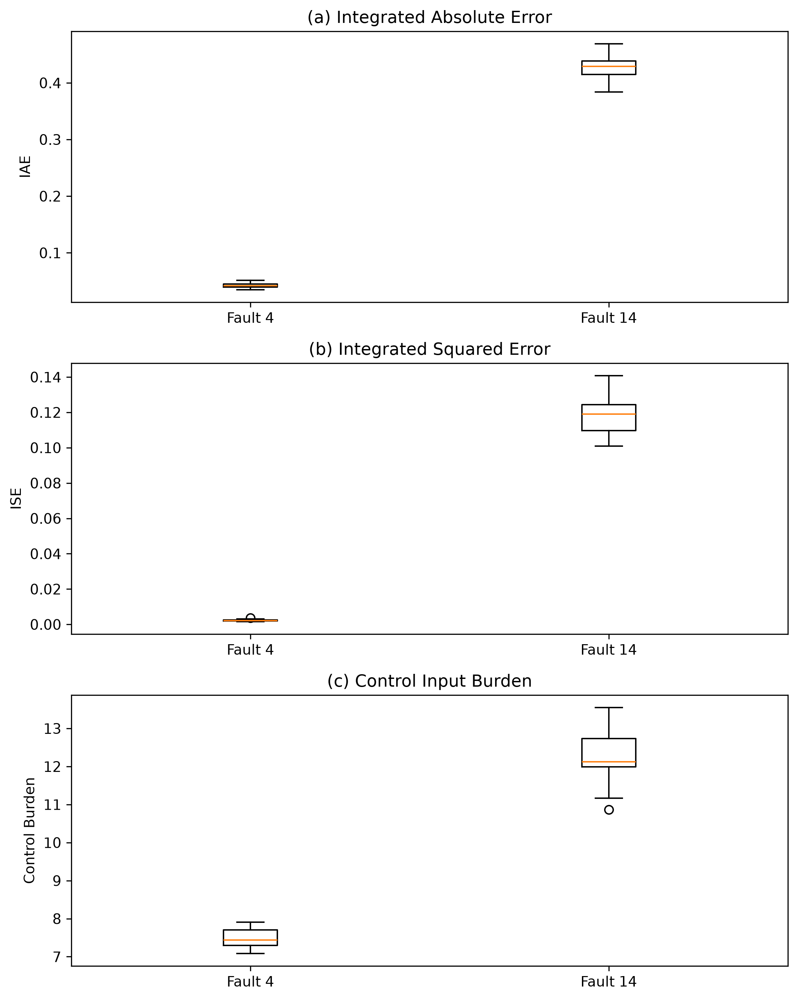

# TEP 냉각계 고장 시계열 분석
## 정상범위에 한 번 들어오면 정말 회복한 것일까?

이 프로젝트는 Tennessee Eastman Process(TEP)의 냉각계 고장 데이터를 이용해  
**“공정값이 정상범위에 처음 들어온 시점만으로 회복을 판단해도 되는가?”**를 분석한 시계열 데이터 프로젝트입니다.

단순히 그래프를 그리는 데서 끝나지 않고,

1. 어떤 질문을 데이터에 던질 것인지 정하고,
2. 데이터를 정제하고,
3. 여러 시계열 분석 방법을 적용하고,
4. 그래프에서 직접 확인되는 사실과 그에 대한 해석을 구분하고,
5. 반복실험과 통계검정을 통해 해석이 우연이 아닌지 확인하는 것

을 목표로 했습니다.

---

# 1. 분석 주제와 선정 이유

## 분석 주제

**Tennessee Eastman Process의 Fault 4와 Fault 14 발생 이후 Reactor Temperature의 동적 회복 과정 비교**

특히 다음 질문에 집중했습니다.

> **고장 이후 온도가 정상범위에 한 번 들어왔다고 해서 공정이 안정적으로 회복했다고 볼 수 있을까?**

---

## 이 주제를 선택한 이유

시계열 분석에서는 특정 값이 상승하거나 하락했다는 사실만 보는 것보다  
**“그 변화가 얼마나 오래 지속되는지”, “다시 안정적으로 돌아왔는지”**를 해석하는 것이 중요합니다.

화학공정에서는 고장이 발생했을 때 센서값이 잠깐 정상으로 돌아왔다가 다시 크게 흔들릴 수도 있습니다.

따라서 단순히

> “정상범위에 들어왔으니 회복했다”

라고 판단하기보다,

- 처음 언제 정상범위에 들어왔는지
- 이후에도 계속 정상범위에 머물렀는지
- 전체적으로 얼마나 많이 흔들렸는지
- 제어기가 얼마나 크게 움직였는지

를 함께 분석해보고자 했습니다.

---

# 2. 화학공학을 모르는 사람을 위한 용어 설명

- **TEP(Tennessee Eastman Process)**  
  실제 화학공장을 단순화해 컴퓨터에서 재현한 대표적인 공정 시뮬레이션 모델입니다.

- **공정(Process)**  
  원료가 반응, 냉각, 분리 등의 단계를 거쳐 제품이 되는 전체 과정입니다.

- **Reactor(반응기)**  
  화학반응이 실제로 일어나는 장치입니다.

- **Cooling Water(냉각수)**  
  반응기에서 발생하는 열을 빼기 위해 사용하는 물입니다.

- **Fault**  
  공정에서 발생한 고장 또는 비정상 상태입니다.

- **Disturbance(외란)**  
  공정의 정상운전을 방해하는 갑작스러운 변화입니다.

- **Valve sticking(밸브 고착)**  
  밸브가 명령대로 부드럽게 움직이지 않고 걸리는 고장입니다.

- **XMEAS**  
  센서가 측정한 공정값입니다.

- **XMV**  
  제어기가 실제로 움직이는 조작값입니다.

- **Closed-loop control**  
  센서값을 확인하면서 제어기가 자동으로 밸브 등을 조절하는 방식입니다.

- **PI Controller**  
  현재 오차와 지금까지 누적된 오차를 이용해 조작값을 자동으로 조절하는 대표적인 제어기입니다.

---

# 3. 분석한 Fault와 변수

## Fault 4

**Reactor Cooling Water Inlet Temperature Step**

반응기로 들어가는 냉각수의 온도가 갑자기 변하는 상황입니다.

쉽게 말하면,

> 반응기를 식히는 물의 온도가 갑자기 달라지는 고장 상황

입니다.

---

## Fault 14

**Reactor Cooling Water Valve Sticking**

반응기 냉각수의 양을 조절하는 밸브가 걸려 원활하게 움직이지 않는 상황입니다.

쉽게 말하면,

> 냉각수를 조절해야 하는 밸브가 제대로 움직이지 않는 고장

입니다.

---

## 주요 분석 변수

### XMEAS(9): Reactor Temperature

반응기 내부 온도입니다.

고장 이후 공정의 출력이 얼마나 크게 흔들리고 다시 정상상태로 돌아오는지 확인하기 위해 사용했습니다.

### XMV(10): Reactor Cooling Water 관련 조작변수

반응기 냉각계에서 제어기가 움직이는 조작값입니다.

온도가 정상으로 돌아오더라도 제어기가 계속 평소보다 크게 움직이고 있다면  
공정이 완전히 원래 상태로 돌아왔다고 보기 어려울 수 있기 때문에 함께 분석했습니다.

---

# 4. 데이터 설명

## 데이터 출처

Tennessee Eastman Process 공개 데이터 및 시뮬레이터:

`jkitchin/tennessee-eastman-profbraatz`

재현에 사용한 simulator commit:

`9a6c8e5fcef4a2850778704e7793c87b0a187005`

License:

**BSD-3-Clause**

---

## 초기 Reference Data

사용 파일:

- `d04_te.dat`
- `d14_te.dat`

각 데이터는:

- 데이터 포인트: 960개
- 기록 간격: 3분
- 전체 기간: 약 48시간
- 변수 수: 52개
  - XMEAS 41개
  - XMV 11개
- Fault 발생 시점: 8시간
- Fault 발생 전 정상 데이터: 160개

과제에서 요구한 **최소 100개 이상의 데이터 포인트**를 충분히 만족합니다.

---

## 추가 반복 시뮬레이션

초기 데이터 한 번만 분석하면 특정 run의 우연한 결과일 가능성이 있기 때문에 반복실험을 추가했습니다.

- Fault 4: 30회
- Fault 14: 30회
- 총 60회
- random seed: 101~130
- simulation duration: 12시간
- fault onset: 8시간
- sampling interval: 3분
- shutdown: 0/60

### Random seed란?

컴퓨터에서 발생하는 랜덤한 변화를 다시 똑같이 재현하기 위한 번호입니다.

Fault 4와 Fault 14에 같은 seed를 사용했습니다.

즉,

> 같은 랜덤 조건에서 Fault 종류만 바꾸어 비교

하는 **paired design**을 사용했습니다.

대표 seed 101에서는 Fault 발생 전 Reactor Temperature의 최대 차이가 **0.0**으로 확인되었습니다.

---

# 5. 분석 질문

과제에서는 최소 3개의 질문을 요구합니다.

이 프로젝트에서는 총 5개의 질문을 설정했습니다.

### 질문 1

**Fault 4와 Fault 14는 Reactor Temperature에서 어떤 시간적 차이를 보이는가?**

→ 그래프로 직접 확인할 수 있는 질문입니다.

### 질문 2

**온도가 정상범위에 처음 들어온 시점과 실제로 안정적으로 회복한 시점은 같은가?**

→ First Recovery와 Settling Time을 비교합니다.

### 질문 3

**Recovery Time 하나만으로 두 Fault의 심각도를 안정적으로 비교할 수 있는가?**

→ 반복실험과 paired comparison을 통해 확인합니다.

### 질문 4

**정상범위를 ±1σ, ±2σ, ±3σ로 바꾸면 분석 결론도 달라지는가?**

→ 분석 기준에 대한 민감도 분석입니다.

### 질문 5

**Moving Average처럼 시계열을 부드럽게 만드는 방법이 Fault 신호를 가릴 수 있는가?**

→ 원본 데이터와 30분 이동평균을 비교합니다.

---

# 6. 데이터 정제

## 결측치

분석 대상 데이터에서 결측치는 발견되지 않았습니다.

따라서 결측치 보간이나 삭제는 수행하지 않았습니다.

---

## 이상치

Fault 발생 이후 갑자기 튀는 값이나 큰 진동은 삭제하지 않았습니다.

일반적인 데이터에서는 이런 값이 이상치로 보일 수 있지만, 이 프로젝트에서는 바로 그 값이 **고장으로 인한 실제 반응**이기 때문입니다.

따라서:

> Fault 이후 spike와 oscillation을 분석해야 할 정보로 보고 그대로 유지했습니다.

---

# 7. 시계열의 트렌드 / 계절성 / 노이즈

## 트렌드

Fault 발생 전 Reactor Temperature는 약 **120.4 부근**에서 유지되었습니다.

즉 Fault 전에는 뚜렷한 장기 상승 또는 하락 추세가 없었고, 가장 큰 구조적 변화는 **8시간의 Fault 발생 이후** 나타났습니다.

---

## 계절성

이 데이터는 주가나 날씨처럼 날짜, 요일, 계절에 따라 반복되는 데이터가 아닙니다.

따라서 일반적인 의미의 일간·주간·월간 **계절성은 관찰되지 않았습니다.**

Fault 14에서 반복적인 진동이 나타났지만, 이는 계절성이 아니라

> 고장 이후 발생한 동적 반복 패턴

으로 해석했습니다.

---

## 노이즈

Fault가 발생하기 전에도 온도는 평균 주변에서 작게 흔들립니다.

이런 짧은 변동은 공정 자체의 변동과 시뮬레이션의 stochastic variation을 포함합니다.

Moving Average를 사용하면 이런 작은 흔들림을 줄여 전체적인 흐름을 보기 쉬워집니다.

하지만 너무 크게 smoothing하면 실제 Fault 신호까지 가릴 수 있다는 점도 확인했습니다.

---

# 8. 사용한 시계열 분석 방법

과제에서는 최소 2가지의 시계열 분석 기법을 요구합니다.

이 프로젝트에서는 2개보다 많은 방법을 사용했습니다.

---

## 방법 1. Moving Average

**Moving Average(이동평균)**는 일정 시간 동안의 평균값을 계속 계산해 그래프를 부드럽게 만드는 방법입니다.

3분 간격 데이터에서 10개 sample을 사용해 약 30분 이동평균을 계산했습니다.

사용 이유:

- 짧은 노이즈를 줄이기 위해
- 전체적인 흐름을 확인하기 위해
- smoothing이 Fault를 가릴 가능성도 확인하기 위해

---

## 방법 2. First Difference

현재 값에서 직전 값을 빼서 변화량을 계산했습니다.

이를 통해 Fault 발생 직후처럼 값이 갑자기 변하는 시점을 찾았습니다.

---

## 방법 3. Rolling Standard Deviation

일정 시간 구간마다 표준편차를 계산했습니다.

이를 통해 평균값만 보는 것이 아니라

> 시간이 지나면서 변동성이 커졌는지

를 확인했습니다.

---

## 방법 4. 구간별 통계

Fault 전과 Fault 후를 나누어:

- 평균
- 표준편차
- 정상범위 체류율
- 누적 오차

등을 비교했습니다.

---

## 방법 5. ACF / FFT

Fault 14에서 보이는 반복적인 진동을 확인하기 위해 사용했습니다.

- **ACF**: 현재 값과 과거 값이 얼마나 비슷하게 반복되는지 확인
- **FFT**: 어떤 반복 주파수 성분이 강한지 확인

다만 반복 성분이 sampling limit에 가까웠기 때문에 정확한 물리적 주기를 단정하지 않았습니다.

---

# 9. 회복을 평가하기 위해 만든 지표

## Recovery Time

Fault 발생 후 온도가 **처음 정상범위에 들어오기까지 걸린 시간**입니다.

---

## Settling Time

온도가 정상범위 안에 들어온 뒤 **30분 동안 연속으로 정상범위에 머물기 시작한 시점**입니다.

데이터가 3분 간격이므로 30분 연속 유지는 **11개 연속 측정값**으로 판단했습니다.

---

## In-range Ratio

Fault 후 첫 2시간 동안 온도가 정상범위 안에 있었던 비율입니다.

예를 들어 90%라면,

> Fault 후 첫 2시간의 대부분을 정상범위 안에서 보냈다

는 뜻입니다.

---

## IAE

**Integrated Absolute Error, 적분절대오차**

온도가 정상 평균에서 얼마나 벗어났는지를 절대값으로 계산하고 시간에 따라 누적한 값입니다.

값이 클수록:

- 많이 벗어났거나
- 오래 벗어나 있었음

을 의미합니다.

---

## ISE

**Integrated Squared Error, 적분제곱오차**

오차를 제곱해서 누적합니다.

큰 오차일수록 훨씬 크게 반영되기 때문에 큰 진동에 민감합니다.

---

## Control Burden

XMV(10)이 Fault 전 정상 평균에서 얼마나 벗어나 있었는지를 시간에 따라 누적한 값입니다.

이 값은

> 제어입력이 평소와 비교해 얼마나 크게 움직였는가

를 보기 위한 상대적 지표입니다.

**실제 냉각수 사용량이나 에너지 소비량을 의미하지 않습니다.**

---

# 10. 시각화 결과

과제 요구사항:

- 필수 2개 이상
- 권장 총 3개 이상

본 프로젝트에서는 핵심 시각화 3개를 REPORT와 README에 포함했습니다.

---

## 그림 1. First Recovery와 Stable Recovery 비교



대표 seed 101의 Reactor Temperature입니다.

- Fault 4 First Recovery: 9분
- Fault 4 Settling Start: 9분
- Fault 14 First Recovery: 63분
- Fault 14 Settling: 4시간 관측창 내 없음

### 그래프에서 직접 확인한 사실

Fault 14도 정상범위에 한 번 들어옵니다.

하지만 이후 다시 정상범위를 반복해서 벗어납니다.

### 해석

따라서

> **정상범위에 처음 들어오는 것과 안정적으로 회복하는 것은 같은 의미가 아닙니다.**

---

## 그림 2. Recovery Time과 In-range Ratio 분포



30개의 반복실험 결과를 비교했습니다.

Fault 14의 Recovery Time은 run마다 크게 달라지지만, In-range Ratio는 지속적으로 매우 낮았습니다.

---

## 그림 3. IAE / ISE / Control Burden 비교



Fault 14는 Fault 4보다:

- IAE
- ISE
- Control Burden

이 모두 크게 나타났습니다.

즉 Fault 14는 단순히 처음 정상범위에 들어오는 시간이 늦은 것뿐 아니라, 전체 관측시간 동안 더 큰 오차와 제어입력 변화를 만들었습니다.

---

# 11. 핵심 결과

주 분석 기준은 각 run의 Fault 전 데이터에서 계산한:

`평균 ± 2σ`

입니다.

여기서 σ는 **표준편차**, 즉 데이터가 평균 주변에서 얼마나 흔들리는지 나타내는 값입니다.

| 지표 | Fault 4 | Fault 14 |
|---|---:|---:|
| Recovery Time 중앙값 | 6.0분 | 19.5분 |
| In-range Ratio 중앙값 | 90.0% | 8.75% |
| IAE 중앙값 | 0.0418 | 0.4291 |
| ISE 중앙값 | 0.0022 | 0.1190 |
| Control Burden 중앙값 | 7.4401 | 12.1264 |
| 4시간 안 Settling | 30/30 | 0/30 |

---

# 12. 질문에 대한 답

## 질문 1. Fault 4와 Fault 14는 시간에 따라 어떻게 다른가?

### 관찰

Fault 4는 Fault 직후 Reactor Temperature가 크게 변하지만 비교적 빠르게 정상 부근으로 돌아옵니다.

반면 Fault 14는 Fault 이후 Reactor Temperature가 계속 크게 위아래로 흔들립니다.

### 해석

Fault 4는 순간적인 외란에 대한 제어 반응에 가깝고, Fault 14는 밸브가 정상적으로 움직이지 않기 때문에 지속적인 진동이 나타나는 것으로 해석할 수 있습니다.

단, 이 결과는 현재 사용한 closed-loop PI controller에서 관찰된 결과입니다.

---

## 질문 2. First Recovery와 Stable Recovery는 같은가?

아닙니다.

대표 seed 101에서:

- Fault 4: Recovery 9분 / Settling 9분
- Fault 14: Recovery 63분 / Settling 없음

Fault 14는 정상범위에 한 번 들어왔음에도 이후 계속 벗어났습니다.

따라서:

> **First Recovery만으로 Stable Recovery를 판단할 수 없습니다.**

---

## 질문 3. Recovery Time 하나만으로 Fault를 비교할 수 있는가?

완전히 안정적이지 않았습니다.

30개의 paired run에서 Recovery Time 기준:

- Fault 14가 더 늦음: 20/30
- 동일: 3/30
- Fault 14가 오히려 더 빠름: 7/30

즉 일부 실험에서는 실제로 훨씬 불안정하게 움직이는 Fault 14가 정상범위에는 더 빨리 들어오기도 했습니다.

반면 다음 지표들은 30/30 모든 paired run에서 Fault 14가 더 불리했습니다.

- In-range Ratio
- IAE
- ISE
- Control Burden

따라서 Recovery Time 하나보다 여러 지표를 함께 보는 것이 더 안정적인 평가를 제공합니다.

---

## 질문 4. 정상범위를 바꾸면 결과가 달라지는가?

정상범위를 ±1σ, ±2σ, ±3σ로 바꾸어 확인했습니다.

| 정상범위 | Fault | Recovery 중앙값 | In-range 중앙값 | 4시간 내 Settling |
|---|---|---:|---:|---:|
| ±1σ | F4 | 13.5분 | 61.25% | 40% |
| ±1σ | F14 | 45.0분 | 5.00% | 0% |
| ±2σ | F4 | 6.0분 | 90.00% | 100% |
| ±2σ | F14 | 19.5분 | 8.75% | 0% |
| ±3σ | F4 | 6.0분 | 97.50% | 100% |
| ±3σ | F14 | 4.5분 | 12.50% | 0% |

±3σ에서는 Recovery Time 중앙값만 보면 오히려 Fault 14가 더 짧습니다.

하지만 paired 결과는:

- Fault 14가 더 늦음: 12
- 동일: 2
- Fault 14가 더 빠름: 16
- Wilcoxon p = 0.1666

으로 방향이 섞였고 통계적으로도 유의하지 않았습니다.

### 해석

정상범위를 넓히면 크게 진동하는 Fault 14도 정상범위를 순간적으로 지나가기 쉬워집니다.

따라서 Recovery Time은 **정상범위를 어떻게 정의하느냐에 민감한 지표**입니다.

---

## 질문 5. Moving Average가 Fault를 가릴 수 있는가?

3분 raw signal과 30분 Moving Average를 비교했습니다.

| Fault | Raw 최대 이탈 | 30분 MA 최대 이탈 | 정상 ±2σ 반폭 |
|---|---:|---:|---:|
| Fault 4 | 0.2007 | 0.0267 | 0.0383 |
| Fault 14 | 0.3799 | 0.0369 | 0.0373 |

30분 Moving Average를 적용하면 두 Fault 모두 최대 이탈이 정상범위 반폭보다 작아졌습니다.

### 해석

Moving Average는 노이즈를 줄이는 데 유용하지만,

> 너무 긴 시간단위로 smoothing하면 짧은 spike나 빠른 진동도 함께 평균화되어 Fault가 잘 보이지 않을 수 있습니다.

따라서 raw signal과 smoothed signal을 함께 확인해야 합니다.

---

# 13. 핵심 인사이트

## 인사이트 1. 정상범위에 한 번 들어온 것과 안정적으로 회복한 것은 다르다

### 관찰(Fact)

±2σ 기준:

- Fault 4: 30/30 run이 4시간 관측창 안에서 Settling
- Fault 14: 0/30 run이 Settling

### 해석(Why)

Fault 14는 정상범위를 순간적으로 통과할 수 있지만 이후 다시 크게 벗어납니다.

### 행동(Action)

공정 회복을 평가할 때 Recovery Time만 보지 않고 Settling Time 또는 In-range Ratio도 함께 확인해야 합니다.

---

## 인사이트 2. Recovery Time은 분석 기준에 민감하다

### 관찰(Fact)

±3σ에서:

- Fault 4 Recovery 중앙값: 6.0분
- Fault 14 Recovery 중앙값: 4.5분
- p = 0.1666

### 해석(Why)

정상범위가 넓어질수록 진동이 큰 신호도 정상범위를 순간적으로 통과하기 쉬워집니다.

### 행동(Action)

한 가지 threshold만 사용하는 대신 ±1σ, ±2σ, ±3σ처럼 여러 기준에서 결과가 유지되는지 확인해야 합니다.

---

## 인사이트 3. 시간 전체를 보는 지표가 더 일관된 결과를 보였다

### 관찰(Fact)

30개의 paired runs에서:

- In-range Ratio: 30/30 Fault 14가 더 나쁨
- IAE: 30/30 Fault 14가 더 큼
- ISE: 30/30 Fault 14가 더 큼
- Control Burden: 30/30 Fault 14가 더 큼

### 해석(Why)

이 지표들은 한 시점만 보는 것이 아니라 일정 시간 동안의 상태를 누적해서 보기 때문에 지속적인 진동을 더 잘 반영합니다.

### 행동(Action)

Post-fault 상태를 평가할 때 단일 시점 KPI보다 여러 시간 기반 지표를 함께 확인하는 것이 좋습니다.

---

## 인사이트 4. 과도한 smoothing은 이상신호를 가릴 수 있다

### 관찰(Fact)

30분 Moving Average에서는 두 Fault의 최대 deviation이 normal ±2σ half-width보다 작아졌습니다.

### 해석(Why)

짧은 spike와 빠른 oscillation이 여러 sample의 평균 속에 섞이기 때문입니다.

### 행동(Action)

시계열 이상분석에서는 이동평균 그래프만 보지 않고 raw data도 함께 확인해야 합니다.

---

# 14. 통계적 검증

동일 seed끼리 Fault 4와 Fault 14를 짝지었기 때문에 **Wilcoxon signed-rank test**를 사용했습니다.

Wilcoxon test는 데이터가 정규분포를 따른다고 강하게 가정하지 않고, paired 두 그룹의 차이를 확인하는 방법입니다.

여러 지표를 동시에 검정했기 때문에 **Holm correction**도 적용했습니다.

| 지표 | Holm-adjusted p | Rank-biserial r |
|---|---:|---:|
| Recovery Time | 3.41e-4 | 0.788 |
| In-range Ratio | 3.15e-6 | -1.000 |
| IAE | 9.31e-9 | 1.000 |
| ISE | 9.31e-9 | 1.000 |
| Control Burden | 9.31e-9 | 1.000 |

### p-value

관찰된 차이가 우연으로 나타났을 가능성을 판단하는 값입니다.

일반적으로 p < 0.05이면 통계적으로 유의한 차이라고 판단합니다.

### Rank-biserial r

두 조건의 차이가 어느 방향으로 얼마나 일관적으로 나타나는지를 보여주는 효과크기입니다.

절댓값이 1에 가까울수록 한 방향으로 매우 일관적입니다.

---

# 15. 관찰과 해석 구분

## 데이터에서 직접 확인한 사실

- 총 60회 simulation이 모두 shutdown 없이 종료됨
- seed 101의 Fault 전 Reactor Temperature 최대 차이 = 0.0
- ±2σ 기준 Fault 4 Settling = 30/30
- ±2σ 기준 Fault 14 Settling = 0/30
- In-range Ratio는 30/30 paired runs에서 Fault 14가 더 낮음
- IAE, ISE, Control Burden은 30/30 paired runs에서 Fault 14가 더 높음
- ±3σ Recovery 비교 p = 0.1666

---

## 데이터에 근거한 해석

- Recovery Time 하나만으로 안정적 회복을 판단하기 어렵다.
- 지속적으로 정상범위에 머무르는지 확인하는 것이 중요하다.
- 누적 오차 지표가 지속적인 Fault response를 더 잘 반영할 수 있다.
- 정상범위 정의에 따라 Recovery Time의 상대적 순위가 달라질 수 있다.

---

## 현재 데이터만으로 말할 수 없는 것

- Control Burden이 실제 냉각수 사용량과 같다는 주장
- Control Burden이 실제 에너지 비용과 같다는 주장
- Fault 14가 모든 종류의 controller에서 동일하게 동작한다는 주장
- 두 Fault 분석만으로 모든 TEP Fault에 일반화하는 주장

---

# 16. 결론

이번 분석에서 가장 중요한 결과는:

> **“정상범위에 처음 들어온 것”과 “안정적으로 회복한 것”은 서로 다를 수 있다는 점입니다.**

Fault 14는 정상범위를 순간적으로 통과하기도 했지만 이후 다시 크게 흔들렸습니다.

또한 Recovery Time은 정상범위를 어떻게 정의하느냐에 따라 Fault 간 순위가 바뀌기도 했습니다.

반면:

- In-range Ratio
- Settling
- IAE
- ISE
- Control Burden

은 Fault 4와 Fault 14의 차이를 더 일관되게 보여주었습니다.

따라서 공정의 Fault 이후 상태를 평가할 때는 Recovery Time 하나만 사용하기보다

> **정상범위 체류시간 + 안정화 여부 + 누적 출력오차 + 제어입력 변화**

를 함께 확인하는 것이 더 안정적인 해석을 제공한다고 판단했습니다.

---

# 17. 한계

1. Fault 4와 Fault 14 두 종류만 비교했습니다.
2. 주요 출력변수는 Reactor Temperature에 집중했습니다.
3. `mean ± σ`로 만든 정상범위는 실제 산업공정의 안전 운전범위가 아닙니다.
4. Settling은 Fault 발생 후 4시간 관측창 안에서만 판단했습니다.
5. Control Burden은 실제 냉각수 또는 에너지 사용량이 아닙니다.
6. 현재 결과는 사용한 closed-loop PI control structure와 함께 나타난 response입니다.
7. 실제 산업공정이 아니라 TEP simulation에서 얻은 결과입니다.

---

# 18. AI 사용 및 검증

AI는 분석을 대신 판단하는 용도가 아니라 다음 작업의 **구현·대안 탐색·검증 보조**로 사용했습니다.

| 사용 작업 | 사용 이유 | 검증 방법 |
|---|---|---|
| 전처리 및 데이터 확인 코드 | 반복 작업의 시간 절감 | shape, 시간축, 결측치 직접 확인 |
| Moving Average 코드 | 시계열 smoothing 구현 | raw data와 결과 비교 |
| Recovery / Settling 코드 | 반복 계산 자동화 | 실제 시간축에서 직접 확인, 30분을 11 samples로 수정 |
| IAE / ISE 코드 | 누적 오차 계산 | notebook 계산값과 각 run 비교 |
| Control Burden 코드 | 제어입력 이탈 정량화 | XMV(10)과 정상 평균으로 직접 재계산 |
| 시각화 코드 | 결과를 한눈에 비교 | 그래프와 원 데이터 수치 비교 |
| Wilcoxon test | paired 차이 검증 | scipy 결과와 paired 방향성 비교 |
| Holm correction | 다중검정 오류 감소 | statsmodels 계산 결과 확인 |
| ±1σ/±2σ/±3σ 분석 | threshold 민감도 검증 | 동일 run에서 threshold만 바꿔 재계산 |
| ACF / FFT | Fault 14의 반복성 탐색 | sampling interval과 Nyquist limit 확인 |
| 문장 다듬기 | 결과를 쉽게 설명 | 모든 수치를 notebook/CSV와 대조 |

AI가 제안한 해석 중 데이터로 직접 확인할 수 없는 내용은 결론으로 사용하지 않았습니다.

---

# 19. 재현 방법

## 개발 환경

- Python 3.10 이상
- Jupyter Notebook

사용 라이브러리:

```text
numpy
pandas
matplotlib
jupyter
scipy
statsmodels
```

설치:

```bash
pip install -r requirements.txt
```

---

## 실행 순서

### 1단계

`analysis.ipynb`

초기 reference data 분석:

- 데이터 로딩
- 결측치 확인
- Moving Average
- 변화율
- Rolling Standard Deviation
- Fault 4 / Fault 14 기본 비교

### 2단계

`ack_analysis.ipynb`

반복실험 및 심화 분석:

- 60-run paired simulation
- Recovery / Settling 계산
- IAE / ISE / Control Burden
- 통계검정
- 방향성 비교
- ±1σ / ±2σ / ±3σ sensitivity analysis

---

# 20. 프로젝트 구조

```text
.
├── analysis.ipynb
├── ack_analysis.ipynb
├── README.md
├── REPORT.md
├── requirements.txt
│
├── data/
│   ├── d04_te.dat
│   └── d14_te.dat
│
├── images/
│   └── 기존 reference-data 분석 이미지
│
├── ack_images/
│   ├── 08_final_recovery_figure_v2.png
│   ├── 06_recovery_inrange_distribution.png
│   └── 07_error_control_distribution.png
│
└── ack_results/
    ├── kpi_30runs.csv
    ├── summary_30runs.csv
    ├── statistical_tests.csv
    ├── directional_consistency.csv
    └── sensitivity_sigma.csv
```

---

# 21. 과제 요구사항 충족 여부

| 과제 요구사항 | 수행 내용 | 충족 |
|---|---|---|
| 시계열 데이터 100개 이상 | Reference data 960 points | ✅ |
| 데이터 출처 명시 | TEP 공개 repository 명시 | ✅ |
| 데이터 기간 명시 | 약 48 h / 반복실험 12 h | ✅ |
| 분석 질문 3개 이상 | 총 5개 질문 | ✅ |
| 기본 데이터 정보 확인 | samples, interval, variables 확인 | ✅ |
| 결측치 확인 | 결측치 없음 확인 | ✅ |
| 이상치 처리 기준 | Fault response이므로 삭제하지 않음 | ✅ |
| 트렌드 설명 | Fault 전 안정적 수준, Fault 후 구조변화 설명 | ✅ |
| 계절성 설명 | 일반적인 calendar seasonality 없음 | ✅ |
| 노이즈 설명 | Fault 전 단기 변동 및 smoothing 영향 설명 | ✅ |
| 시계열 기법 2개 이상 | Moving Average, First Difference, Rolling STD, ACF/FFT 등 | ✅ |
| 시각화 2개 이상 | 핵심 이미지 3개 포함 | ✅ |
| 인사이트 3개 이상 | Fact/Why/Action 형식 4개 | ✅ |
| 관찰과 해석 구분 | 별도 섹션 작성 | ✅ |
| 결론 작성 | 분석 근거 기반 결론 작성 | ✅ |
| 한계점 작성 | 7개 한계 명시 | ✅ |
| Python 코드 | analysis.ipynb, ack_analysis.ipynb | ✅ |
| GitHub 저장소 | 코드/리포트/결과 저장 | ✅ |
| requirements.txt | 사용 라이브러리 명시 | ✅ |
| 실행 방법 | Notebook 실행 순서 명시 | ✅ |
| 데이터 라이선스 | BSD-3-Clause 명시 | ✅ |
| AI 사용 작업 | AI 사용 로그 작성 | ✅ |
| AI 사용 이유 | AI 사용 로그에 명시 | ✅ |
| AI 검증 방법 | 직접 계산/재현/비교 방법 명시 | ✅ |

---

# 22. 보너스 과제

이번 프로젝트에서는 **대시보드 또는 예측 모델은 추가하지 않았습니다.**

대신 필수 요구사항을 넘어서 다음 심화 분석을 수행했습니다.

- 60회 반복 시뮬레이션
- paired experimental design
- Wilcoxon signed-rank test
- Holm multiple-testing correction
- effect size
- threshold sensitivity analysis
- ACF / FFT
- aggregation counterexample

따라서 예측보다는

> **“분석 결과가 얼마나 안정적으로 재현되는가?”**

를 검증하는 방향으로 프로젝트를 심화했습니다.

---

# 23. 한 줄 요약

> **정상범위에 한 번 들어온 것과 실제로 안정적으로 회복한 것은 다르며, Recovery Time 하나보다 여러 시계열 지표를 함께 보는 것이 더 안정적인 공정 상태 평가를 제공했습니다.**