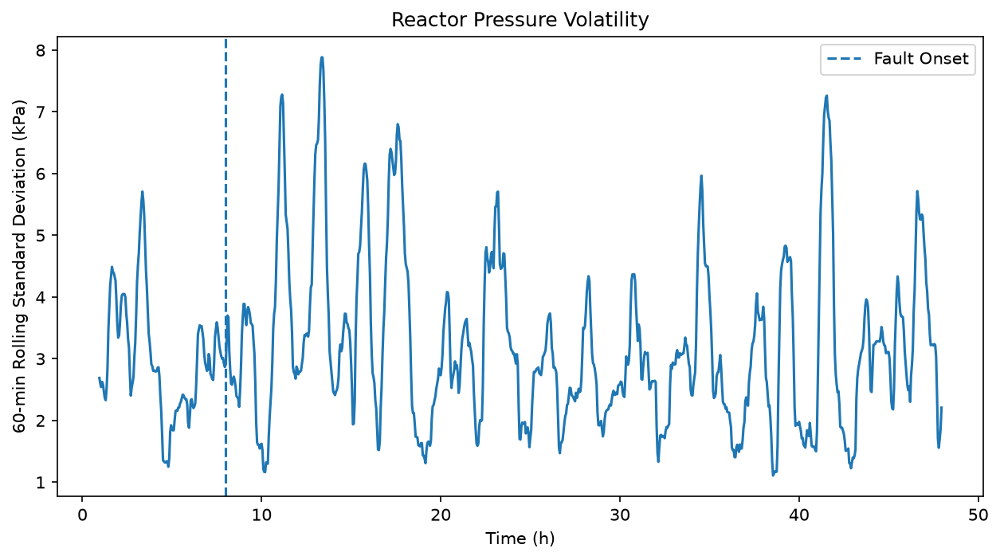

# TEP Fault 4 시계열 분석 리포트

## 냉각수 이상 발생 시 반응기 상태와 제어계의 동적 반응 분석

## 1. 분석 주제 및 선정 이유

이번 분석에서는 Tennessee Eastman Process(TEP)의 Fault 4 데이터를 이용해 **반응기 냉각수 이상이 발생했을 때 공정 변수가 시간에 따라 어떻게 변화하는지** 확인했다.

화학공정에서 반응기 온도는 반응속도와 운전 안정성에 영향을 주는 중요한 변수다. 특히 냉각 조건이 변하면 반응기 온도뿐만 아니라 압력과 냉각수 제어량에도 변화가 나타날 수 있다.

따라서 단순히 Fault 발생 여부만 확인하는 것이 아니라,

**온도 변화 → 냉각수 제어 대응 → 압력 변화 → 공정 안정성**

의 흐름을 시계열 데이터로 분석하고자 했다.

---

## 2. 분석 질문

1. Fault 발생 후 반응기 온도는 어떻게 변하는가?
2. 반응기 냉각수 유량 조작변수는 Fault에 어떻게 대응하는가?
3. Fault 발생 전후 공정의 변동성은 어떻게 달라지는가?
4. 반응기 온도가 회복된 이후에도 압력 등 다른 공정 변수에는 영향이 남는가?

---

## 3. 데이터 설명

이번 분석에는 Tennessee Eastman Process의 Fault 4 test 데이터를 사용했다.

* 데이터 파일: `d04_te.dat`
* 데이터 포인트: 960개
* 변수 수: 52개
* 측정 간격: 3분
* 전체 분석 시간: 약 48시간
* Fault 발생 시점: 8시간
* Fault 종류: Reactor Cooling Water Inlet Temperature Step Change

52개의 변수는 다음과 같이 구성되어 있다.

* XMEAS 41개: 공정에서 측정되는 변수
* XMV 11개: 제어계가 조작하는 변수

이번 분석에서 주요하게 사용한 변수는 다음과 같다.

| 변수        | 의미                         |
| --------- | -------------------------- |
| `xmeas_7` | Reactor Pressure           |
| `xmeas_9` | Reactor Temperature        |
| `xmv_10`  | Reactor Cooling Water Flow |

### 데이터 출처

Tennessee Eastman Process 공개 reference dataset을 사용했다.

원본 데이터 및 변수 정의는 `jkitchin/tennessee-eastman-profbraatz` 공개 GitHub repository를 참고했다.

원본 데이터의 라이선스 및 저작권 조건을 확인하고 출처를 명시해 사용했다.

---

## 4. 데이터 확인 및 전처리

### 4.1 데이터 구조

원본 데이터를 Python으로 불러온 결과 데이터의 크기는 다음과 같았다.

```text
(960, 52)
```

즉, 시간에 따라 기록된 960개 데이터 포인트와 각 시점의 52개 공정 변수가 존재한다.

### 4.2 시간축 생성

원본 데이터에는 별도의 시간 컬럼이 없기 때문에 3분의 sampling interval을 이용해 시간축을 생성했다.

```python
df["time_h"] = np.arange(len(df)) * 3 / 60
```

한 데이터 포인트는 3분, 즉 0.05시간에 해당한다.

처음 160개 데이터는 정상 운전구간이며,

160 × 3분 = 480분 = 8시간

이므로 8시간을 Fault 발생 시점으로 설정했다.

### 4.3 결측치 처리

전체 데이터의 결측치 개수를 확인한 결과:

```text
0
```

으로 확인되었다.

따라서 결측치에 대한 별도의 삭제나 보간은 수행하지 않았다.

### 4.4 이상치 처리

Fault 발생 시점에서 반응기 온도와 냉각수 유량에 큰 변화가 관찰되었다.

그러나 이번 분석의 목적 자체가 Fault 발생에 따른 공정 변화를 확인하는 것이므로, 단순히 통계적으로 큰 값이라는 이유로 이를 제거하지 않았다.

즉, 명백한 데이터 입력 오류가 아닌 Fault와 관련된 급격한 변화는 **분석 대상**으로 유지했다.

---

## 5. 시계열 데이터의 특징

### 트렌드

트렌드는 시간에 따른 장기적인 상승 또는 하락 흐름을 의미한다.

반응기 온도는 전체 48시간 동안 약 120.4°C 부근에서 유지되었으며 장기적인 상승 또는 하락 추세는 뚜렷하게 나타나지 않았다.

### 계절성

계절성은 일정한 주기로 반복되는 패턴을 의미한다.

이번 데이터는 48시간 동안 하나의 Fault 상황을 관찰한 공정 시뮬레이션 데이터이므로 일·주·월 단위로 반복되는 계절성 분석에는 적합하지 않다. 따라서 본 분석에서는 계절성을 주요 분석 대상으로 설정하지 않았다.

### 노이즈

노이즈는 전체적인 흐름과 별개로 나타나는 단기적이고 불규칙한 변동이다.

반응기 온도는 120.4°C 부근에서 작은 폭으로 계속 변동했으며, 이러한 단기 변동과 전체 흐름을 구분하기 위해 이동평균을 사용했다.

---

## 6. 시계열 분석 방법

### 6.1 30분 이동평균

원본 데이터는 3분마다 측정되므로 10개의 데이터 포인트는 30분에 해당한다.

따라서 다음과 같이 30분 이동평균을 계산했다.

```python
df["temp_ma_30m"] = df["xmeas_9"].rolling(10).mean()
```

이동평균은 단기적인 노이즈를 완화하고 전체적인 온도 흐름을 확인하기 위해 사용했다.

### 6.2 변화량

현재 온도와 직전 시점의 온도 차이를 계산했다.

```python
df["temp_change"] = df["xmeas_9"].diff()
```

이를 통해 어느 시점에서 반응기 온도가 가장 빠르게 변했는지 확인했다.

### 6.3 60분 Rolling Standard Deviation

3분 간격 데이터 20개는 60분에 해당한다.

따라서 최근 60분 동안 공정 변수가 얼마나 크게 흔들리는지 확인하기 위해 rolling standard deviation을 계산했다.

```python
df["temp_std_60m"] = df["xmeas_9"].rolling(20).std()
df["pressure_std_60m"] = df["xmeas_7"].rolling(20).std()
```

### 6.4 Fault 전후 구간 비교

8시간을 기준으로 데이터를 정상구간과 Fault 이후 구간으로 나눠 평균과 표준편차를 비교했다.

---

## 7. 분석 결과

### 7.1 반응기 온도와 이동평균


전체적으로 반응기 온도는 약 120.4°C 부근에서 유지됐다.

Fault 발생 직전인 7.95 h의 반응기 온도는 **120.37°C**였지만, Fault가 발생한 8.00 h에는 **120.60°C**까지 상승했다.

3분 뒤인 8.05 h에는 다시 **120.40°C**로 감소했다.

또한 전체 데이터의 온도 변화량을 비교한 결과:

* 8.00 h: +0.23°C
* 8.05 h: -0.20°C
* 그다음 큰 변화: 약 ±0.08°C

로 나타났다.

따라서 Fault 발생 직후의 온도 변화가 전체 960개 데이터 중에서도 매우 큰 변화였음을 확인했다.

30분 이동평균에서는 이러한 순간적인 spike가 완화되어 나타났으며 전체적인 온도 수준은 약 120.4°C 부근에서 유지되는 것을 확인할 수 있었다.

---

### 7.2 반응기 온도와 냉각수 유량의 대응


Fault 직전인 7.95 h에서 냉각수 유량 조작변수 XMV10은 **40.694**였다.

Fault 발생 시점인 8.00 h에는 **47.248**로 증가했다.

이는 직전 시점 대비 약 **16.1% 증가**한 값이다.

또한 구간별 평균을 비교한 결과:

* 정상구간 평균: 41.14
* Fault 이후 평균: 44.89

로 나타났다.

Fault 이후 냉각수 유량 평균은 정상구간보다 약 **9.1% 높은 수준**이었다.

반면 반응기 온도는 Fault 발생 3분 후 기존 수준에 가까워졌다.

즉, 반응기 온도는 빠르게 정상 수준으로 돌아왔지만 냉각수 조작량은 이전보다 높은 수준을 유지했다.

---

### 7.3 반응기 압력 변동성



Fault 발생 직전 반응기 압력은 2708.2 kPa였다.

Fault 이후 압력은 계속 상승해 **8.10 h에 2716.6 kPa**로 최대값을 기록했다.

반면 반응기 온도의 최대값은 **8.00 h**에 나타났다.

따라서 온도 최대 반응과 압력 최대 반응 사이에는 약 **6분의 시간차**가 있었다.

또한 반응기 압력의 전체 표준편차를 비교한 결과:

* 정상구간: 5.13 kPa
* Fault 이후: 7.81 kPa

로 나타났다.

이는 정상구간보다 약 **52.1% 증가한 값**이다.

다만 rolling standard deviation 그래프를 보면 Fault 이후 모든 시점에서 변동성이 계속 높은 것은 아니며, 여러 구간에서 큰 변동성 peak가 반복적으로 나타났다.

따라서 Fault 이후 압력 변동성이 증가했다고 볼 수 있지만, 이후 모든 압력 변화를 Fault 하나의 영향으로 단정할 수는 없다.

---

## 8. 인사이트

### 인사이트 1. Fault는 반응기 온도에 짧고 강한 변화를 만들었다.

**관찰(Fact)**

Fault 직전 반응기 온도는 120.37°C였지만 Fault 발생 시점에는 120.60°C로 3분 만에 0.23°C 상승했다.

이는 전체 960개 시점 중 가장 큰 온도 상승폭이었다.

그러나 다음 3분 동안 -0.20°C 감소하며 다시 기존 수준에 가까워졌다.

**해석(Hypothesis)**

냉각수 조건 변화가 반응기 열적 상태에 순간적인 영향을 주었지만, 반응기 온도는 빠르게 제어된 것으로 해석할 수 있다.

**의미**

이동평균이나 전체 평균만 확인하면 짧은 시간에 발생한 이상 반응을 놓칠 수 있다.

따라서 공정 이상을 확인할 때는 원본 시계열과 변화량을 함께 확인할 필요가 있다.

---

### 인사이트 2. 온도가 정상으로 돌아온 뒤에도 제어 노력은 이전보다 증가했다.

**관찰(Fact)**

XMV10은 Fault 순간 40.694에서 47.248로 약 16.1% 증가했다.

또한 Fault 이후 평균 XMV10은 정상구간보다 약 9.1% 높은 수준을 유지했다.

**해석(Hypothesis)**

냉각 조건이 변한 뒤 반응기 온도를 기존 수준으로 유지하기 위해 제어계가 더 높은 냉각수 유량을 사용한 것으로 해석할 수 있다.

**의미**

측정되는 공정 변수 하나가 정상 범위에 있다고 해서 공정 조건 전체가 정상이라고 단정하기 어렵다.

공정 상태를 판단할 때는 측정변수뿐 아니라 조작변수와 제어 노력도 함께 확인할 필요가 있다.

---

### 인사이트 3. 같은 Fault라도 공정 변수별 반응 속도는 달랐다.

**관찰(Fact)**

반응기 온도의 최대값은 8.00 h에 나타났지만 반응기 압력의 최대값은 8.10 h에 나타나 약 6분의 차이를 보였다.

또한 Fault 이후 압력의 표준편차는 정상구간보다 약 52.1% 높았다.

**해석(Hypothesis)**

냉각 조건 변화의 영향이 모든 공정 변수에 동시에 같은 형태로 나타나는 것이 아니라 공정 내부의 동특성에 따라 서로 다른 시간 지연을 두고 나타난 것으로 해석할 수 있다.

**의미**

화학공정은 여러 공정변수가 서로 연결되어 있으므로 특정 센서 하나만으로 공정 전체의 안정성을 판단하기 어렵다.

따라서 온도, 압력, 조작변수 등 여러 시계열을 함께 살펴볼 필요가 있다.

---

## 9. 결론

이번 분석에서는 Tennessee Eastman Process의 Fault 4 데이터를 이용해 냉각수 이상 발생 전후의 반응기 동적 거동을 확인했다.

Fault 발생 순간 반응기 온도는 120.37°C에서 120.60°C까지 급격히 상승했지만 3분 뒤 다시 120.40°C로 복귀했다.

동시에 냉각수 유량 조작변수는 약 16.1% 증가했으며 Fault 이후에도 정상구간보다 평균적으로 약 9.1% 높은 수준을 유지했다.

이를 통해 **반응기 온도가 정상 수준으로 복귀했다고 해서 공정 상태가 Fault 이전과 완전히 동일하다고 볼 수는 없다는 점**을 확인했다.

또한 반응기 압력의 최대 반응은 온도보다 약 6분 늦게 나타났으며, Fault 이후 압력 변동성도 정상구간보다 크게 나타났다.

따라서 화학공정의 시계열 분석에서는 하나의 측정변수만 확인하기보다 **측정변수, 조작변수, 변화량, 변동성을 함께 분석하는 것이 중요하다**고 판단했다.

---

## 10. 한계점

1. Tennessee Eastman Process는 실제 플랜트가 아닌 화학공정 시뮬레이션 데이터다.
2. 이번 분석은 Fault 4의 단일 test run을 중심으로 수행했다.
3. 변수 간 시간적 관계만으로 직접적인 인과관계를 확정할 수는 없다.
4. Fault 이후 압력 변동성이 증가했지만 이후 모든 압력 변화가 Fault 하나만의 영향이라고 단정할 수 없다.
5. 52개의 전체 공정변수를 분석하지 않고 반응기 온도, 압력, 냉각수 유량을 중심으로 분석했다.
6. 이번 분석은 예측보다 Fault 발생 전후의 패턴과 의미를 해석하는 데 초점을 맞췄다.

---

## 11. AI 사용 로그

### 사용 작업

* 분석 방향 및 질문 후보 설정
* Python 코드 작성 과정에서 함수 사용 방법 확인
* 이동평균, 변화량, rolling standard deviation 분석 방법 탐색
* 시각화 방법 검토
* 분석 결과 해석 및 리포트 문장 정리

### 사용 이유

Python과 시계열 분석을 처음부터 구현하는 과정에서 필요한 코드와 분석 방법을 빠르게 확인하기 위해 AI를 활용했다.

또한 그래프에서 발견한 패턴을 공정제어 관점에서 어떤 방식으로 해석할 수 있는지 여러 가능성을 검토하기 위해 사용했다.

### 검증 방법

AI가 제시한 코드를 그대로 결과로 사용하지 않고 Jupyter Notebook에서 직접 한 단계씩 실행했다.

다음 항목을 직접 확인했다.

* 데이터 크기: 960 × 52
* 결측치: 0개
* Fault 전후 실제 데이터 값
* Fault 순간 반응기 온도 변화량
* 냉각수 유량 증가율
* 정상/Fault 구간 평균 비교
* 온도 및 압력 peak 발생 시점
* 압력 표준편차 증가율
* 각 그래프와 계산된 수치가 일치하는지 확인

또한 데이터에서 직접 확인할 수 있는 내용은 **관찰(Fact)**로, 가능한 원인 설명은 **해석(Hypothesis)**으로 구분해 작성했다.

---

## 12. 실행 방법

필요한 라이브러리를 설치한다.

```bash
pip install -r requirements.txt
```

VSCode에서 `analysis.ipynb`를 열고 첫 번째 셀부터 순서대로 실행한다.

분석 과정에서 생성된 그래프는 `images/` 폴더에 저장된다.
