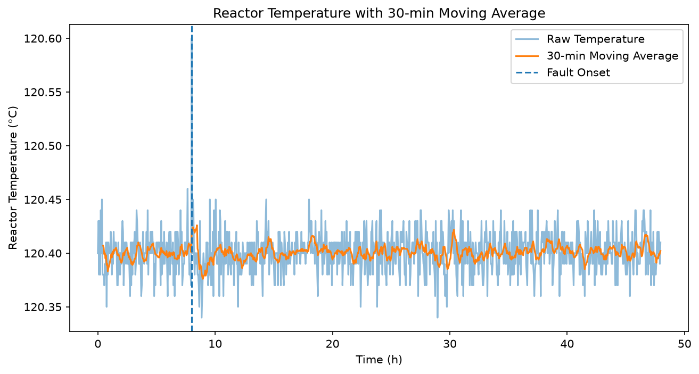
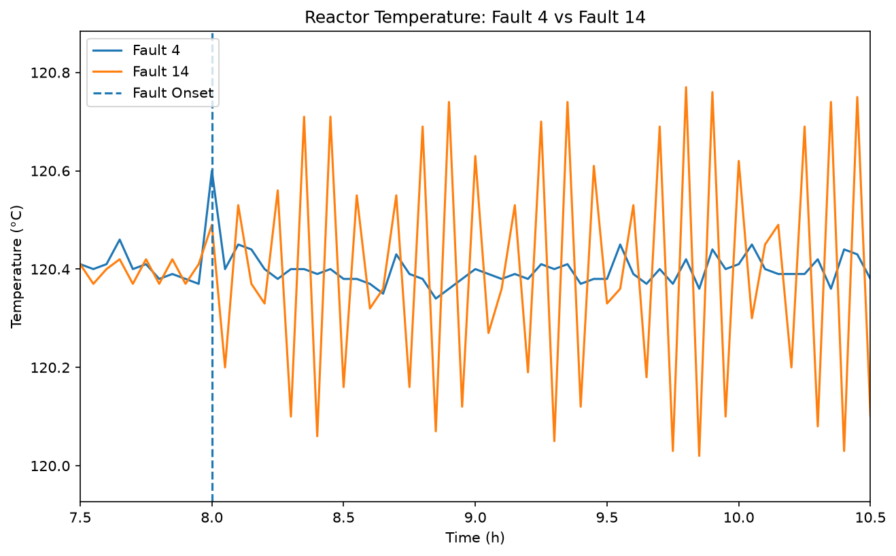
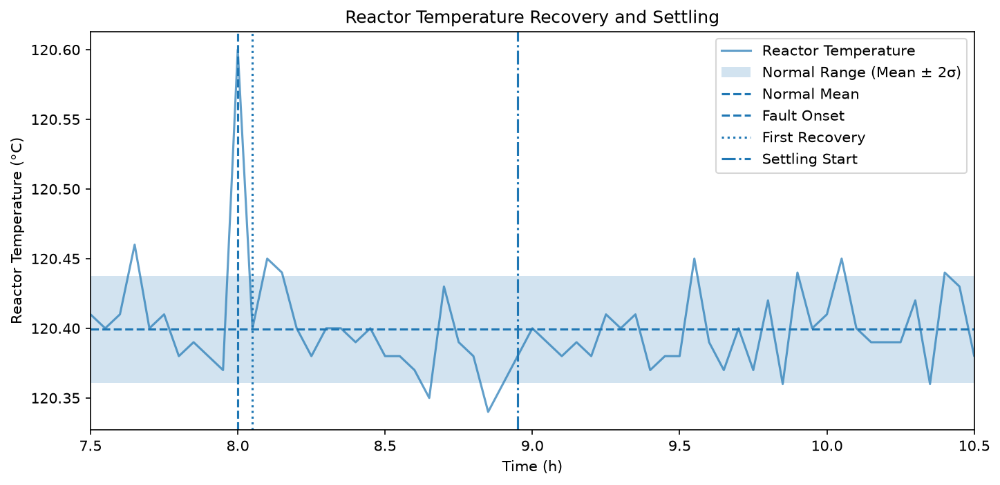
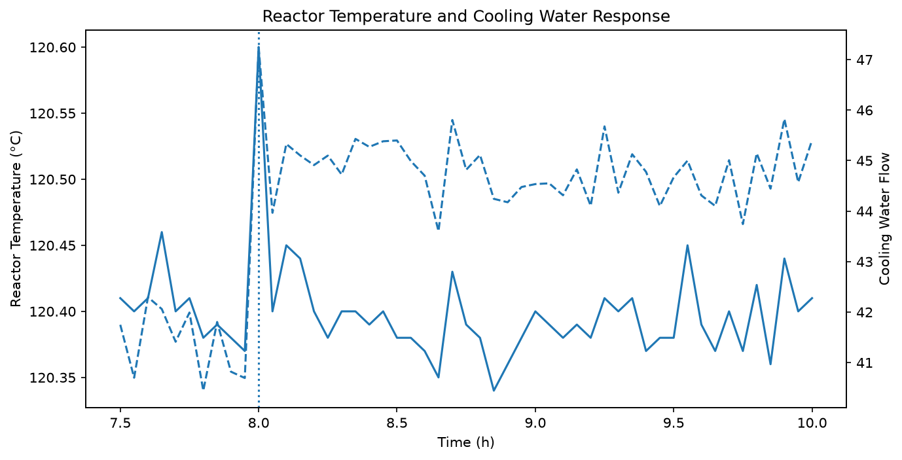
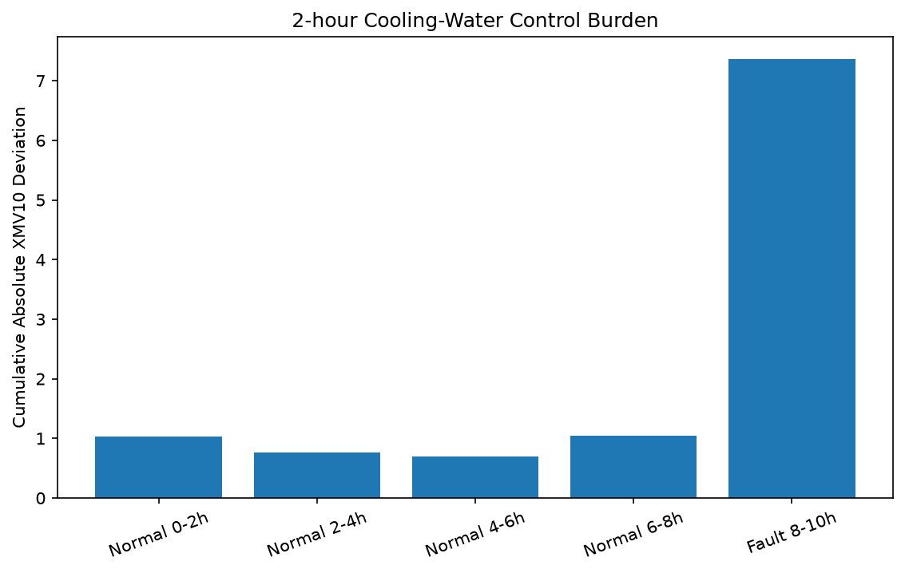
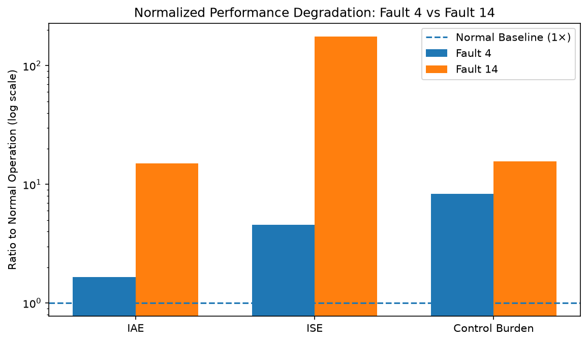
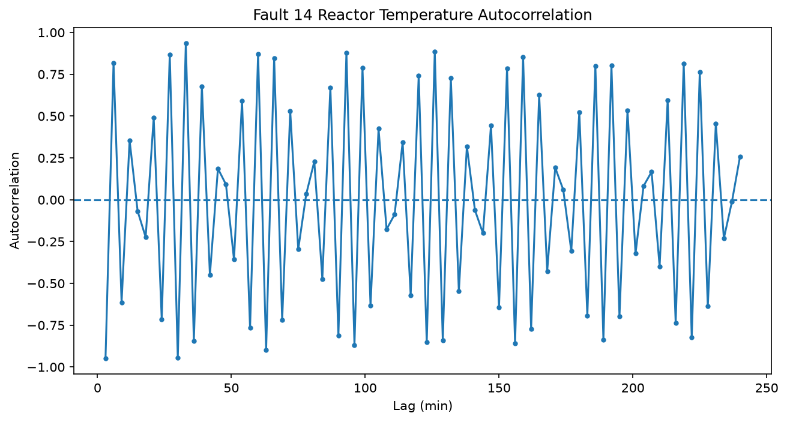

# TEP 냉각계 고장에 따른 공정 회복과 제어성능 비교

### Fault 4와 Fault 14의 시계열 분석

---

# 1. 프로젝트 소개

화학공정에서 반응기 온도가 한 번 정상값으로 돌아왔다고 해서 공정 전체가 완전히 안정되었다고 볼 수 있을까?

본 프로젝트는 이 질문에서 시작하였다.

Tennessee Eastman Process(TEP)의 냉각계 관련 고장인 **Fault 4**와 **Fault 14**를 대상으로, 고장 종류에 따라 반응기 온도와 냉각수 관련 제어신호가 어떻게 다르게 움직이는지 분석하였다.

두 고장은 모두 반응기 냉각계와 관련되어 있지만 원인은 다르다.

- **Fault 4**: Reactor Cooling Water Inlet Temperature Step  
  → 반응기로 들어오는 냉각수의 온도 조건이 갑자기 변하는 이상

- **Fault 14**: Reactor Cooling Water Valve Sticking  
  → 반응기 냉각수 밸브가 원활하게 움직이지 않는 이상

단순히 두 그래프의 모양만 비교하지 않고, 정상 운전구간을 기준으로 다음과 같은 지표를 계산하였다.

- 처음 정상범위로 돌아오는 데 걸린 시간
- 실제로 안정적인 상태가 되는 데 걸린 시간
- 정상범위에 머문 비율
- 온도 오차의 누적 정도
- 큰 온도 이탈의 심각성
- 냉각수 관련 제어신호의 움직임

이를 통해 **같은 냉각계 이상이라도 고장 원인에 따라 서로 다른 시간적 패턴이 나타나는지** 확인하고자 하였다.

---

# 2. 분석 질문

본 프로젝트에서는 다음 다섯 가지 질문을 설정하였다.

### Q1.
Fault 4와 Fault 14는 반응기 온도에서 어떤 서로 다른 패턴을 보이는가?

### Q2.
고장 이후 온도는 얼마나 빨리 정상범위로 돌아오며, 실제로 안정되는 데에는 얼마나 걸리는가?

### Q3.
고장 이후 온도 제어성능은 정상 운전에 비해 얼마나 나빠지는가?

### Q4.
반응기 온도를 유지하기 위해 냉각수 관련 제어신호는 평소보다 얼마나 크게 움직이는가?

### Q5.
눈으로 관찰한 온도·압력의 시간차와 Fault 14의 반복적인 온도 흔들림을 추가적인 시계열 분석으로도 확인할 수 있는가?

---

# 3. 데이터

## 3.1 데이터 출처

본 프로젝트에서는 Tennessee Eastman Process reference test data를 사용하였다.

원본 저장소:

`https://github.com/jkitchin/tennessee-eastman-profbraatz`

사용한 파일은 다음과 같다.

- `d04_te.dat`
- `d14_te.dat`

원본 저장소는 BSD-3-Clause License로 공개되어 있다.

---

## 3.2 데이터 구조

각 Fault 데이터는 다음과 같이 구성되어 있다.

- 관측 시점: **960개**
- 공정 변수: **52개**
- 측정변수(XMEAS): **41개**
- 조작변수(XMV): **11개**
- 측정 간격: **3분**
- 전체 관측시간: 약 **48시간**
- Fault 발생시점: **8시간**

시간축은 다음과 같이 생성하였다.

```python
df["time_h"] = np.arange(len(df)) * 3 / 60
```

즉 데이터 한 행은 3분을 의미한다.

---

## 3.3 주요 분석 변수

| 변수 | 의미 |
|---|---|
| `XMEAS(7)` | Reactor Pressure |
| `XMEAS(9)` | Reactor Temperature |
| `XMEAS(21)` | Reactor Cooling Water Outlet Temperature |
| `XMV(10)` | Reactor Cooling Water 관련 조작변수 |

본 프로젝트에서는 특히 **반응기 온도 `XMEAS(9)`**와 **냉각수 관련 조작변수 `XMV(10)`**을 중심으로 분석하였다.

반응기 온도는 공정 상태가 얼마나 안정적으로 유지되는지를 보기 위해 사용하였다.

XMV(10)은 반응기 온도를 유지하기 위해 제어계가 얼마나 크게 움직이는지 확인하는 데 사용하였다.

---

# 4. 데이터 확인과 전처리

## 4.1 결측치

Fault 4 데이터와 Fault 14 데이터를 확인한 결과 결측치는 발견되지 않았다.

따라서 별도의 결측치 대체는 수행하지 않았다.

---

## 4.2 이상치 처리

Fault 발생 직후 나타나는 큰 온도 변화나 반복적인 흔들림은 일반적인 데이터 분석에서는 이상치처럼 보일 수 있다.

하지만 본 프로젝트에서는 이러한 변화 자체가 분석하고자 하는 **고장 신호**이다.

따라서 값이 크다는 이유만으로 제거하지 않고 원본 데이터를 그대로 사용하였다.

---

# 5. 정상 운전 기준 설정

Fault 이후 공정이 정상으로 돌아왔는지를 판단하려면 먼저 정상 운전 상태를 정의해야 한다.

각 Fault 데이터에서 Fault가 발생하기 전인

`0 h ≤ time < 8 h`

구간을 정상 운전구간으로 사용하였다.

정상 상태에서도 반응기 온도는 완전히 일정하지 않고 조금씩 흔들리기 때문에 다음과 같이 통계적 정상범위를 설정하였다.

**정상범위 = 정상 평균 ± 2 × 표준편차**

표준편차는 정상 상태에서 온도가 평균 주변에서 얼마나 흔들리는지를 나타내는 값이다.

### Fault 4

- 정상 평균: **120.3993 °C**
- 정상 표준편차: **0.01917 °C**
- 정상범위: **120.3610 ~ 120.4377 °C**

### Fault 14

- 정상 평균: **120.3999 °C**
- 정상 표준편차: **0.01863 °C**
- 정상범위: **120.3626 ~ 120.4371 °C**

두 데이터의 정상 평균과 변동범위는 매우 비슷하였다.

다만 이 정상범위는 실제 화학공장의 안전운전 기준이 아니다.

두 Fault를 같은 기준으로 비교하기 위해 본 프로젝트에서 설정한 **통계적 기준**이다.

---

# 6. 기본 시계열 분석

## 6.1 이동평균

3분 간격 데이터 10개를 이용하여 **30분 이동평균**을 계산하였다.

이동평균은 짧은 시간 동안 발생하는 작은 흔들림을 줄이고 전체적인 흐름을 보기 쉽게 해준다.



Fault 4의 반응기 온도는 전체적으로 약 120.4 °C 부근에서 유지되었다.

하지만 8시간 부근의 순간적인 온도 변화는 이동평균을 적용하면 작게 보였다.

따라서 짧은 고장을 분석할 때는 이동평균만 보는 것이 아니라 **원본 데이터와 변화량도 함께 확인할 필요가 있다.**

---

## 6.2 온도 변화량

연속된 두 시점의 반응기 온도 차이를 계산하였다.

**온도 변화량 = 현재 온도 - 이전 온도**

Fault 4 발생 직전인 7.95 h에서 반응기 온도는 **120.37 °C**였다.

8.00 h에서는 **120.60 °C**까지 증가하였다.

따라서 3분 동안:

**+0.23 °C**

의 변화가 발생하였다.

이는 전체 960개 시점 가운데 가장 큰 양의 온도 변화였다.

다음 시점인 8.05 h에는 **120.40 °C**로 감소하면서:

**-0.20 °C**

의 변화가 나타났다.

따라서 Fault 4는 온도를 오랫동안 크게 변화시키기보다는 **짧고 강한 순간적인 충격을 주는 형태**라고 볼 수 있었다.

---

# 7. Fault 4와 Fault 14의 온도 반응 비교

두 Fault의 고장 발생 직후 반응기 온도를 같은 그래프에서 비교하였다.



두 고장의 차이는 그래프에서도 매우 뚜렷하게 나타났다.

### Fault 4

Fault 발생 순간 온도가 크게 한 번 상승하지만 이후 비교적 빠르게 원래 수준으로 돌아온다.

### Fault 14

Fault 발생 이후 온도가 정상값 주변에서 계속 크게 위아래로 움직인다.

본 보고서에서는 이러한 반복적인 움직임을 **진동(oscillation)**이라고 표현하였다.

즉 두 고장은 모두 냉각계와 관련되어 있지만 반응기 온도에 나타나는 패턴은 서로 달랐다.

**Fault 4는 순간 충격 후 회복되는 형태**,  
**Fault 14는 지속적으로 흔들리는 형태**에 가까웠다.

---

# 8. 처음 회복한 것과 실제 안정된 것은 다를까?

Fault 이후 공정의 회복을 평가하기 위해 **Recovery Time**과 **Settling Time**을 구분하였다.

---

## 8.1 Recovery Time

Recovery Time은:

> Fault 발생 후 반응기 온도가 처음으로 정상범위 안에 다시 들어오기까지 걸린 시간

으로 정의하였다.

Fault 4의 Recovery Time은 **3분**이었다.

즉 Fault가 발생한 8.00 h 이후 8.05 h에는 이미 정상범위 안으로 돌아왔다.

하지만 그래프를 보면 이후 다시 정상범위를 벗어나는 구간이 있었다.



따라서 한 번 정상범위에 들어왔다고 해서 공정이 완전히 안정되었다고 보기 어려웠다.

---

## 8.2 Settling Time

본 프로젝트에서는 안정적인 회복을 다음과 같이 정의하였다.

> **정상범위에서 최소 30분 동안 연속으로 유지**

데이터 간격이 3분이므로 **10개 관측값이 연속으로 정상범위에 있어야 한다.**

그 결과는 다음과 같다.

### Fault 4

- Recovery Time: **3분**
- Settling Time: **57분**

Fault 4는 3분 만에 처음 정상범위에 들어왔지만 실제로 30분 이상 안정적으로 유지되는 구간이 시작되기까지는 **57분**이 걸렸다.

즉 최초 회복과 안정적인 회복 사이에는 약 **54분의 차이**가 있었다.

### Fault 14

- Recovery Time: **9분**
- Settling Time: **관측기간 내 확인되지 않음**

Fault 14도 9분 후 한 번 정상범위 안에 들어왔다.

하지만 이후 계속 정상범위를 벗어났기 때문에 30분 동안 연속으로 정상범위를 유지하는 구간은 확인되지 않았다.

따라서:

> **정상범위에 한 번 들어오는 것과 실제 공정이 안정되는 것은 서로 다르다.**

는 것을 확인하였다.

---

# 9. 정상범위에 실제로 얼마나 오래 있었을까?

Recovery Time은 한 순간의 복귀만 보여준다는 한계가 있다.

이를 보완하기 위해 Fault 발생 후 첫 2시간 동안 전체 관측값 중 정상범위에 포함된 비율을 계산하였다.

분석구간은 두 Fault 모두 동일하게:

`8.00 h ≤ time < 10.00 h`

로 설정하였다.

| Fault | 정상범위 체류율 |
|---|---:|
| Fault 4 | **77.5%** |
| Fault 14 | **2.5%** |

Fault 4는 첫 2시간 동안 약 4분의 3 이상을 정상범위 안에서 보냈다.

반면 Fault 14는 첫 2시간 동안 **97.5%의 관측시점이 정상범위 밖**에 있었다.

Fault 14의 Recovery Time만 보면 "9분 후 회복했다"고 생각할 수 있지만 실제로는 거의 모든 시간 동안 정상범위를 벗어나 있었다.

따라서 공정 회복을 평가할 때는 Recovery Time뿐 아니라 **정상범위 체류율도 함께 확인할 필요가 있었다.**

---

# 10. 온도 제어성능 비교

두 Fault가 반응기 온도에 미친 영향을 숫자로 비교하기 위해 IAE와 ISE를 사용하였다.

이름은 어렵지만 의미는 비교적 단순하다.

---

## 10.1 IAE

IAE는 **Integral Absolute Error**의 약자이다.

쉽게 말하면:

> 온도가 정상 평균에서 벗어난 정도를 시간 동안 계속 더한 값

이다.

첫 2시간의 결과는 다음과 같다.

| Fault | IAE |
|---|---:|
| Fault 4 | **0.0494 °C·h** |
| Fault 14 | **0.4415 °C·h** |

Fault 14의 IAE는 Fault 4보다 약 **8.94배** 컸다.

각 Fault의 정상상태와 비교하면:

- Fault 4: **1.66배**
- Fault 14: **15.08배**

였다.

즉 Fault 14에서는 반응기 온도가 정상값에서 벗어난 상태가 훨씬 오래 지속되었다.

---

## 10.2 ISE

ISE는 **Integral Squared Error**의 약자이다.

IAE와 비슷하지만 온도오차를 제곱해서 더한다.

따라서 **큰 온도 이탈에 더 큰 점수를 주는 지표**이다.

첫 2시간 결과는 다음과 같다.

| Fault | ISE |
|---|---:|
| Fault 4 | **0.00333 °C²·h** |
| Fault 14 | **0.12130 °C²·h** |

Fault 14의 ISE는 Fault 4보다 약 **36.4배** 컸다.

각 Fault의 정상상태와 비교하면:

- Fault 4: **4.56배**
- Fault 14: **175.81배**

였다.

Fault 14에서 ISE가 특히 크게 증가한 이유는 큰 온도 이탈이 반복적으로 발생했기 때문이다.

여기서 **175.81배는 온도가 175배 상승했다는 의미가 아니다.**

큰 오차를 제곱하는 ISE라는 지표가 정상상태보다 그만큼 증가했다는 의미이다.

---

# 11. 온도가 정상이어도 제어기는 평소보다 많이 움직일 수 있을까?

이번에는 냉각수 관련 조작변수인 **XMV(10)**을 확인하였다.

Fault 4 발생 직전 XMV(10)은:

**40.694**

였고 Fault 발생 순간:

**47.248**

까지 증가하였다.

약 **16.1% 증가**한 값이다.

또한 Fault 4의 정상 XMV(10) 평균은 약 **41.14**, Fault 이후 평균은 약 **44.89**였다.

즉 Fault 이후에도 평균적으로 약 **9.1% 높은 수준**이 유지되었다.



그래프에서 반응기 온도는 비교적 빠르게 원래 수준으로 돌아왔지만 XMV(10)은 이전보다 높은 수준을 유지하였다.

따라서:

> **반응기 온도가 정상처럼 보여도 제어시스템은 평소보다 더 많은 조작을 하고 있을 수 있다.**

는 것을 확인하였다.

---

# 12. 제어신호의 부담 비교

제어신호가 정상상태와 비교해 얼마나 많이 움직였는지를 비교하기 위해 **Control Burden**이라는 지표를 사용하였다.

본 프로젝트에서는:

> XMV(10)이 정상 평균에서 벗어난 절대적인 크기를 시간 동안 누적한 값

으로 정의하였다.

이는 실제 냉각수 소비량이나 에너지 비용을 의미하는 것이 아니라, **제어신호가 평소 수준에서 얼마나 크게 벗어나 움직였는지를 나타내는 상대적인 지표**이다.

Fault 발생 후 첫 2시간 결과는 다음과 같다.

- Fault 4: **7.364**
- Fault 14: **12.679**



각 Fault의 정상 2시간 구간과 비교하면:

- Fault 4: 정상보다 **8.34배**
- Fault 14: 정상보다 **15.60배**

였다.

정상 상태에서 원래 발생하는 움직임을 제외한 초과 Control Burden은:

- Fault 4: **6.481**
- Fault 14: **11.866**

였다.

Fault 4에서는 XMV(10)이 주로 정상보다 높은 수준으로 이동한 뒤 유지되는 모습이 나타났다.

반면 Fault 14에서는 XMV(10)이 정상보다 높은 값과 낮은 값을 반복하며 크게 움직였다.

즉 두 Fault는 반응기 온도뿐 아니라 **제어신호에서도 서로 다른 패턴**을 보였다.

---

# 13. 정상 운전과 비교하면 얼마나 나빠졌을까?

IAE, ISE, Control Burden을 각 Fault의 정상 운전 상태와 비교하였다.



| 지표 | Fault 4 | Fault 14 |
|---|---:|---:|
| IAE / Normal | **1.66배** | **15.08배** |
| ISE / Normal | **4.56배** | **175.81배** |
| Control Burden / Normal | **8.34배** | **15.60배** |

세 지표 모두 Fault 14에서 더 큰 변화가 나타났다.

특히 ISE의 큰 증가는 Fault 14에서 **큰 온도 이탈이 반복적으로 발생했다는 특징**을 반영한다.

다만 IAE, ISE, Control Burden은 계산방법과 단위가 서로 다르다.

따라서 세 지표의 숫자 크기를 서로 직접 비교하지 않고 **각 지표 안에서 Fault 4와 Fault 14를 비교하였다.**

---

# 14. 온도와 압력의 반응에는 시간차가 있을까?

Fault 4에서 반응기 온도의 최고점은:

**8.00 h**

에서 나타났다.

반응기 압력의 최고점은:

**8.10 h**

에서 나타났다.

두 시점 사이에는 약 **6분의 차이**가 있었다.

처음에는:

> 압력이 온도보다 약 6분 늦게 반응하는 것이 아닐까?

라는 가설을 세웠다.

하지만 최고점 두 개만 비교해서 시간지연을 판단하기에는 근거가 부족하였다.

그래서 추가로 **교차상관(Cross-correlation)** 분석을 수행하였다.

---

## 14.1 교차상관 분석

교차상관은:

> 두 시계열 중 하나를 시간축에서 조금씩 이동시키면서 어느 시간차에서 두 움직임이 가장 비슷한지 확인하는 방법

이다.

7.5~10 h 구간에서 온도와 압력을 비교한 결과:

- 0분 시차 상관계수: **0.241**
- 6분 시차 상관계수: **0.277**
- 가장 높은 상관계수: **0.360**
- 해당 시차: **24분**

이었다.

전체적으로 강한 상관관계는 나타나지 않았다.

---

## 14.2 변화량으로 다시 확인

온도와 압력의 값 자체가 아니라 **각 시점에서 얼마나 변했는가**를 이용해 다시 분석하였다.

그 결과:

- 가장 강한 시차: **0분**
- 상관계수: **0.274**

였다.

음의 상관관계까지 포함해 확인했지만 이보다 강한 관계는 나타나지 않았다.

따라서:

> **온도 최고점과 압력 최고점 사이에는 6분 차이가 있었지만, 압력이 항상 온도보다 6분 늦게 반응한다고 판단할 근거는 충분하지 않았다.**

고 결론내렸다.

처음 세운 가설을 추가 분석 결과에 따라 수정한 것이다.

---

# 15. Fault 14의 반복적인 온도 흔들림

Fault 14에서는 Fault 발생 이후 반응기 온도가 계속 위아래로 움직였다.

이 움직임이 단순한 무작위 흔들림인지 반복적인 구조가 있는지를 확인하기 위해 **자기상관(Autocorrelation)**을 사용하였다.

자기상관은:

> 현재 온도 패턴과 일정 시간 전의 온도 패턴이 얼마나 비슷한지 확인하는 방법

이다.



Fault 발생 후 8~20 h 구간에서 분석한 결과 여러 시간차에서 높은 자기상관이 반복되었다.

대표적인 값은 다음과 같다.

| 시간차 | 자기상관 |
|---:|---:|
| 33 min | **0.936** |
| 60 min | **0.872** |
| 93 min | **0.880** |
| 126 min | **0.885** |
| 159 min | **0.852** |
| 192 min | **0.802** |

높은 자기상관 값이 여러 시간차에서 반복적으로 나타난 것은 Fault 14의 온도 변화가 단순한 random noise가 아니라 **반복적인 구조를 포함하고 있을 가능성**을 보여준다.

---

# 16. FFT를 이용한 반복 속도 확인

Fault 14의 반복적인 움직임을 다른 방법으로 확인하기 위해 FFT(Fast Fourier Transform)를 사용하였다.

FFT는 시간에 따른 데이터를:

> 어떤 속도의 반복적인 움직임이 강하게 들어 있는가?

라는 관점으로 분석하는 방법이다.

분석 결과 가장 강한 성분은:

- Dominant frequency: **9.08 cycles/hour**
- 해당 period: 약 **6.61분**

이었다.

하지만 이 결과는 주의해서 해석해야 한다.

본 데이터는 **3분마다 한 번씩 측정**된다.

따라서 6.61분의 움직임 한 번에 실제 데이터가:

**6.61 / 3 ≈ 2.2개**

밖에 존재하지 않는다.

즉 한 번의 진동을 약 두 개의 관측값으로 보고 있는 셈이다.

또한 이 주파수는 현재 측정 간격으로 구별할 수 있는 가장 빠른 영역에 매우 가깝다.

따라서:

> **Fault 14에서 빠른 반복 진동이 강하게 나타나는 것은 확인되지만, 정확한 물리적 진동주기가 6.61분이라고 단정하기는 어렵다.**

고 해석하였다.

---

# 17. 최종 비교

| 지표 | Fault 4 | Fault 14 |
|---|---:|---:|
| 처음 정상범위 복귀 | **3 min** | **9 min** |
| 안정적으로 정착 | **57 min** | **확인되지 않음** |
| 첫 2시간 정상범위 체류율 | **77.5%** | **2.5%** |
| IAE | **0.0494** | **0.4415** |
| ISE | **0.00333** | **0.12130** |
| Control Burden | **7.364** | **12.679** |
| IAE / Normal | **1.66배** | **15.08배** |
| ISE / Normal | **4.56배** | **175.81배** |
| Control Burden / Normal | **8.34배** | **15.60배** |

두 Fault는 같은 반응기 냉각계와 관련되어 있지만 공정에서 나타나는 시간적 패턴은 뚜렷하게 달랐다.

### Fault 4

**큰 순간 변화 → 빠른 최초 회복 → 이후 안정화**

### Fault 14

**지속적인 온도 진동 → 매우 낮은 정상범위 체류율 → 안정화 실패**

의 형태를 보였다.

---

# 18. 핵심 인사이트

## Insight 1. 정상범위에 들어온 것과 실제 안정화는 다르다.

### 관찰

Fault 4는 Fault 발생 3분 후 정상범위에 처음 들어왔지만 실제로 안정적으로 정상범위에 머물기 시작하기까지는 57분이 걸렸다.

Fault 14도 9분 후 정상범위에 한 번 들어왔지만 이후 계속 범위를 벗어나 안정적인 정착이 확인되지 않았다.

### 의미

한 시점에서 값이 정상범위로 돌아온 것만으로 공정 전체가 회복되었다고 판단하면 실제 회복상태를 과대평가할 수 있다.

---

## Insight 2. 온도가 정상이어도 제어계는 정상상태가 아닐 수 있다.

### 관찰

Fault 4에서는 반응기 온도가 비교적 빠르게 정상 수준으로 돌아왔지만 첫 2시간 동안 Control Burden은 정상상태보다 약 **8.34배** 높았다.

### 의미

공정 출력값이 정상처럼 보이더라도 이를 유지하기 위해 제어시스템이 평소보다 훨씬 크게 움직이고 있을 수 있다.

따라서 공정 모니터링에서는 측정값뿐 아니라 조작변수의 움직임도 함께 확인할 필요가 있다.

---

## Insight 3. 같은 냉각계 이상이라도 서로 다른 패턴을 보인다.

### 관찰

Fault 4는 짧고 강한 온도 spike 이후 회복되었다.

Fault 14는 지속적인 온도 진동과 큰 제어신호 변화를 보였다.

Fault 14의 정상 대비 IAE는 **15.08배**, ISE는 **175.81배**였으며 Fault 4보다 크게 나타났다.

### 의미

같은 냉각계에서 발생한 이상이라도 고장 원인이 다르면 공정에 남기는 시간적 패턴도 달라질 수 있다.

이러한 패턴은 향후 고장 유형을 구분하는 특징으로 활용할 수 있다.

---

## Insight 4. Peak 시점 차이만으로 원인관계를 판단하기 어렵다.

### 관찰

온도 최고점과 압력 최고점 사이에는 6분 차이가 있었다.

하지만 교차상관 분석에서는 고정된 6분 지연관계를 지지하는 강한 상관이 나타나지 않았다.

### 의미

몇 개의 눈에 띄는 peak만 보고 두 공정변수 사이의 관계를 단정하기보다 전체 시계열을 추가적으로 확인해야 한다.

---

# 19. 화학공학에서의 활용 가능성

본 프로젝트에서 사용한 방법은 실제 화학공정의 여러 문제와 연결할 수 있다.

## 공정 모니터링

반응기 온도가 정상범위 안에 있더라도 냉각수 관련 제어신호가 평소보다 크게 움직이고 있다면 공정이 정상 상태를 유지하기 위해 추가적인 제어를 수행하고 있을 수 있다.

따라서 센서값과 조작변수를 함께 분석하면 눈에 바로 보이지 않는 이상상태를 찾는 데 도움이 될 수 있다.

---

## 고장 진단

Fault 4와 Fault 14처럼 고장 종류에 따라:

- 순간적인 spike
- 반복적인 진동
- 회복시간
- 정상범위 체류율
- 제어신호 변화

등이 다르게 나타난다면 이를 고장 유형을 구분하는 특징으로 활용할 수 있다.

---

## 예지보전

밸브나 냉각계 관련 조작변수가 평소보다 지속적으로 크게 움직이는 패턴이 반복된다면 설비 상태가 나빠지고 있는지를 탐색하는 지표로 확장할 수 있다.

---

## 공정제어

Recovery Time, Settling Time, IAE, ISE 등을 사용하면 단순히:

**현재 온도가 정상인가?**

만 확인하는 것이 아니라:

- 얼마나 빨리 회복했는가?
- 실제로 안정적으로 유지되는가?
- 온도오차가 얼마나 누적되었는가?
- 제어시스템은 얼마나 크게 움직였는가?

까지 함께 평가할 수 있다.

---

## 공정안전

반응기 냉각계는 온도제어와 직접 연결된다.

따라서 냉각계 이상이 발생했을 때 온도가 잠시 정상범위에 들어온 것만 확인하는 것보다 실제로 안정적인 상태를 유지하는지를 확인하는 것이 중요하다.

---

# 20. 분석의 한계

본 프로젝트에는 다음과 같은 한계가 있다.

## 1. 각 Fault의 한 개 run만 분석하였다.

Fault 4와 Fault 14 각각 하나의 test run을 분석하였다.

따라서 현재 결과가 해당 Fault의 모든 경우에서 동일하게 나타난다고 일반화할 수 없다.

향후 여러 독립 run을 분석하여 평균과 변동성을 비교하면 결과의 신뢰도를 높일 수 있다.

---

## 2. 정상범위는 분석을 위한 기준이다.

`평균 ± 2 × 표준편차`는 실제 화학공장의 공식 안전운전 범위가 아니다.

본 프로젝트에서 정상상태와 Fault 상태를 비교하기 위해 사용한 통계적 기준이다.

---

## 3. Settling 기준도 분석용 기준이다.

30분 동안 연속으로 정상범위를 유지하는 조건은 실제 산업 표준이 아니다.

두 Fault의 회복성을 같은 기준으로 비교하기 위해 설정하였다.

---

## 4. Control Burden은 실제 냉각수 사용량이 아니다.

Control Burden은 XMV(10) 제어신호가 정상 평균에서 얼마나 벗어났는지를 시간에 따라 누적한 값이다.

따라서 실제 냉각수 소비량, 에너지 사용량 또는 비용으로 직접 해석할 수 없다.

---

## 5. 상관관계는 인과관계를 의미하지 않는다.

Cross-correlation은 두 변수의 움직임이 어느 정도 비슷한지를 보여주는 방법이다.

온도가 압력을 직접 변화시켰다는 인과관계를 증명하는 것은 아니다.

---

## 6. FFT의 정확한 주기 추정에는 한계가 있다.

Fault 14에서 약 6.6분의 강한 반복 성분이 계산되었지만 데이터가 3분 간격이기 때문에 정확한 주기를 판단하기에는 데이터 해상도가 부족하다.

따라서 빠른 반복 진동이 존재한다는 보조적인 결과로만 사용하였다.

---

# 21. AI 활용 및 검증

본 프로젝트에서는 AI를 분석 결과를 대신 만드는 도구가 아니라 **개념 학습과 코드 작성 보조 도구**로 사용하였다.

주요 활용 내용은 다음과 같다.

- 이동평균과 rolling statistics 개념 이해
- Recovery Time 계산방법
- Settling Time 계산방법
- IAE와 ISE 개념 및 구현
- Control Burden 계산방법 구성
- Cross-correlation 구현
- Autocorrelation 구현
- FFT와 sampling 한계 이해
- 분석 결과 해석 검토

모든 코드는 로컬 Python/Jupyter 환경에서 직접 실행하였다.

AI가 제안한 해석도 그대로 사용하지 않고 실제 데이터 출력과 그래프를 확인하였다.

예를 들어 처음에는 온도와 압력 peak 사이의 6분 차이를 일정한 시간지연으로 생각하였다.

하지만 cross-correlation을 추가 수행한 결과 이를 뒷받침하는 강한 관계가 나타나지 않아 초기 해석을 수정하였다.

Fault 14의 FFT에서도 약 6.6분의 주기가 계산되었지만 3분 sampling interval의 한계를 확인한 뒤 정확한 물리적 주기로 단정하지 않았다.

---

# 22. 결론

본 프로젝트에서는 Tennessee Eastman Process의 두 냉각계 관련 이상인 Fault 4와 Fault 14의 반응을 비교하였다.

Fault 4는 순간적으로 큰 온도 변화를 보였지만 비교적 빠르게 회복하였다.

- Recovery Time: **3분**
- Settling Time: **57분**
- 첫 2시간 정상범위 체류율: **77.5%**

반면 Fault 14에서는 지속적인 온도 진동이 나타났다.

- Recovery Time: **9분**
- Settling Time: **관측기간 내 확인되지 않음**
- 첫 2시간 정상범위 체류율: **2.5%**

온도 제어성능과 제어신호 움직임에서도 Fault 14의 영향이 더 크게 나타났다.

- Fault 4 IAE / Normal: **1.66배**
- Fault 14 IAE / Normal: **15.08배**

- Fault 4 ISE / Normal: **4.56배**
- Fault 14 ISE / Normal: **175.81배**

- Fault 4 Control Burden / Normal: **8.34배**
- Fault 14 Control Burden / Normal: **15.60배**

이를 통해 얻은 가장 중요한 결론은 다음과 같다.

> **공정 출력값이 순간적으로 정상범위에 돌아온 것과 실제 공정이 안정적으로 회복된 것은 서로 다르다.**

따라서 공정 이상을 평가할 때 단순한 현재 온도만 확인하는 것이 아니라:

- 얼마나 빨리 회복했는지
- 얼마나 안정적으로 유지되는지
- 온도오차가 얼마나 누적되었는지
- 제어신호가 평소보다 얼마나 많이 움직이는지

를 함께 살펴볼 필요가 있다.

또한 같은 냉각계와 관련된 고장이라도 고장 원인에 따라 공정에 서로 다른 시계열 패턴이 나타날 수 있음을 확인하였다.

---

# 23. 재현 방법

## 사용 환경

- Python 3.10+
- NumPy
- pandas
- Matplotlib
- Jupyter

필요한 패키지는 `requirements.txt`에 기록하였다.

## 프로젝트 구조

```text
tep-cooling-fault-analysis/
├── analysis.ipynb
├── REPORT.md
├── README.md
├── requirements.txt
├── data/
│   ├── d04_te.dat
│   └── d14_te.dat
└── images/
```

## 실행 방법

1. 저장소를 로컬 환경에 clone한다.
2. 가상환경을 생성하고 활성화한다.
3. `requirements.txt`의 패키지를 설치한다.
4. `analysis.ipynb`를 첫 셀부터 순서대로 실행한다.
5. 생성된 그래프와 계산 결과를 확인한다.